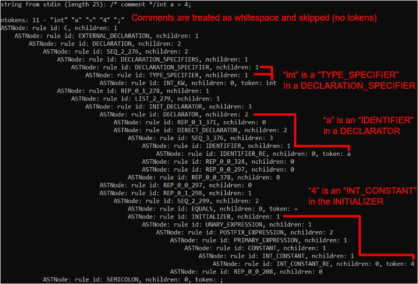
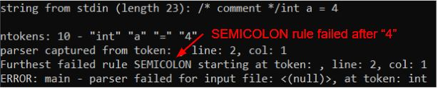

# Example use of <b>peggy</b> parser generater: a C parser in ~300 LoC

## Overview

The binary built here will parse C headers and source files (post-preprocessing) and provide the resulting ASTs. It should cover standard C (preC23) with the notable exception of K&R function definition declaration lists removed. For C23, I think I have most of the standard covered but I made no attempt to ensure compatibility with the new character sets and constant expansions. In many cases, the grammar will look much more like C11 simply because I think C11's grammar description was much more conducive to an efficient PEG.

I intend to use this to build my toy language and a transpiler to C. Let me know if you have any other interests!

## How to build

1) build <b>peggy</b> at the top level of the repo
2) in this directory, run one of the following
    - `make` - will build `c` binary in `/path/to/peggy/bin` and create a few sample ASTs from sample_files/ and put them in the same directory
    - `make check_libc` - this will run through the C standard libraries in `sample_files/libc` and parse them. If any errors occur they will be printed

Optionally change the compiler and C dialect by setting the make variable CC, e.g.
- `make CC=clang STDC_DIALECT=-std=c99` will build and run tests with `clang -std=c99` set
    - if you're checking files written with C23 and its new character set changes, this probably won't work
- note, I'm not sure about building with compilers other than `gcc` and `clang` right now, but if you want to test the parser with a different compiler, you can simply run `make` with `gcc` or `clang` and then `make check_libc CC=your_compiler` after to test how the headers change.

As of now (8/11/2024), I have checked `make check_libc` on Windows (Msys), Linux (Ubuntu 22.04), NetBSD (9.0), OpenBSD (7.5), FreeBSD (14.0) with both `gcc` and `clang` and all headers successfully parse (no error...not sure about accuracy yet) with 2 exceptions:
1) NetBSD apparently does not have `<uchar.h>`, at least not in the standard search locations
2) many of the BSD unsurprisingly don't have `<threads.h>`

## How to use:

There are two ways to build the AST from a sample file (extentions don't matter):
- pipe from stdin
    - `/path/to/peggy/bin/c < my_preprocessed_c_file` or `cat my_preprocessed_c_file | /path/to/peggy/bin/c`
- pass file directly:
    - `/path/to/peggy/bin/c my_preprocessed_c_file`

The first is especially useful to allow piping directly from the compiler after preprocessing:

`echo -e "some code to try" | gcc -E -xc - | /path/to/peggy/bin/c > my_c_file.ast`

If errors occur during parsing, messages right before any partial printing of the AST will provide information on how much of the input was tokenized and successfully parsed as well as which grammar rule was the last to fail before the parser stopped. If such an error occurred, the syntax error is between the final token and where this last rule failure occurred. Sorry, I have not included very detailed syntax error descriptions yet.

The output has 3 sections:

```
[contents of data from stdin if any]
[token list and status of parse including description of tokens captured by parse and any errors that occurred as well as on which line/col]
[The resulting AST if any]
```

As an example:
```
echo -e "/* comment */int a = 4; " | /path/to/peggy/bin/c
```


```
echo -e "/* comment */int a = 4 " | /path/to/peggy/bin/c
```


## Issues

If you try a different system and identify a syntax that is not parsed (usually a `gcc` extension), let me know with an issue that includes what syntax failed to parse. The error messages described below should identify the correct place in the code. If you can also suggest a change to the `c.grmr` file, excellent!

You might come across a builtin type or typedef that is not standard C. These can be added to the `BUILTIN_TYPES` array at the top of `cparser.c` to handle them. I have only come across 2 used in the standard library headers I have seen, but I am sure there are plenty more.

## Adding K&R function declaration lists

If you really need it, change the `function_definition` production in the `c.grmr` function from

```
function_definition:
	attribute_specifier*, declaration_specifiers, declarator, compound_statement
```

to

```
function_definition:
	attribute_specifier*, declaration_specifiers, declarator, declaration* compound_statement
```

But I make no promises that it will parse correctly. Some extention syntaxes would look suspiciously like function definitions if the declarations are allowed and I am not sure how well the PEG parser will accept this change.